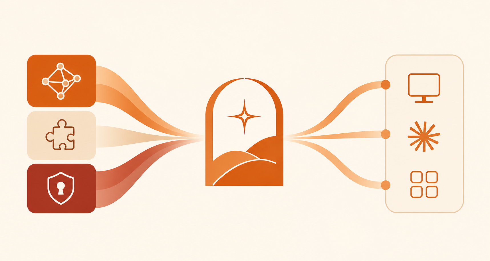

# Arkon

**Enterprise knowledge management for Claude — self-hosted, on-premise.**

Arkon gives organizations centralized control over how employees use Claude. Admins manage knowledge, access policies, and project contexts from a single portal. Employees connect once and get the right context automatically through the Model Context Protocol (MCP).

---

## The problem

Most organizations adopt Claude team-by-team with no shared knowledge, inconsistent context, and no visibility into how AI is being used. Every employee manually pastes documents, repeats the same background, and gets different answers depending on what they remembered to include.

Arkon treats Claude as a managed organizational resource — not a public chatbot.

---

## Features

### Knowledge Base
Upload documents (PDF, DOCX, spreadsheets, URLs) and they become semantically searchable by Claude. Knowledge is chunked, embedded, and stored with pgvector. Retrieval is contextual — Claude queries the knowledge base at runtime via MCP, not from a pasted wall of text.

- Organize by **knowledge type** (SOP, Product, HR Policy, etc.) — admin-defined
- Assign documents to **departments** for scoped access
- Background ingestion pipeline with real-time progress tracking
- Optional graph entity extraction via Neo4j

### Access Control (RBAC)
Fine-grained access at department and individual level. When an employee connects via MCP, Arkon resolves their identity, department, and knowledge scope — then filters what they can query.

```
Sales dept     → knowledge: product catalog, customer profiles
Support dept   → knowledge: FAQs, troubleshooting SOPs
HR dept        → knowledge: internal policies, org structure
Individual     → personal scope override if needed
```

### Projects
Cross-functional knowledge contexts for initiatives that don't fit neatly into a department.

Create a **Project** (client engagement, product launch, board prep) → add members from any department → attach relevant documents. Project members get access to those documents through MCP automatically. When the project ends, archive it.

### MCP Server
Employees connect Claude Desktop to Arkon's MCP server using a personal token. Tools available in Claude:

| Tool | Description |
|---|---|
| `search_knowledge` | Semantic search across accessible documents |
| `get_document` | Retrieve full document content |
| `list_sources` | Browse available documents |
| `list_categories` | Browse knowledge type tree |
| `find_contacts` | Search the internal people directory |
| `get_category_knowledge` | Retrieve all docs of a specific type |

---

## Architecture

```
┌──────────────────────────────────────────────────┐
│                  On-Premise Server                │
│                                                   │
│  ┌───────────────┐    ┌────────────────────────┐  │
│  │  Admin Portal │    │    Arkon API + MCP     │  │
│  │               │    │                        │  │
│  │  · Knowledge  │───▶│  · Knowledge Graph     │  │
│  │  · RBAC       │    │  · Scope Resolution    │  │
│  │  · Projects   │    │  · MCP Tool Server     │  │
│  │  · Contacts   │    │  · Auth & Tokens       │  │
│  └───────────────┘    └───────────┬────────────┘  │
│                                   │               │
└───────────────────────────────────┼───────────────┘
                                    │ MCP (HTTPS)
                       ┌────────────┼────────────┐
                       │            │            │
                Claude Desktop   Claude.ai   Any MCP
                (employees)      (web)       client
```

**Stack:**
- **Backend** — FastAPI, PostgreSQL + pgvector, Redis (arq), MinIO
- **Frontend** — Next.js, Tailwind CSS
- **Optional** — Neo4j for knowledge graph entity extraction
- **Outbound** — Claude API (Anthropic) only. No other external calls.

---

## Getting Started

### Prerequisites

- Docker and Docker Compose
- A Claude API key from [Anthropic](https://console.anthropic.com)

### 1. Clone and configure

```bash
git clone https://github.com/your-org/arkon.git
cd arkon
cp .env.example .env
```

Edit `.env` — at minimum set:

```env
SECRET_KEY=your-random-secret-here
DEFAULT_ADMIN_EMAIL=admin@yourcompany.com
DEFAULT_ADMIN_PASSWORD=change-this-password
```

### 2. Start services

```bash
docker compose up -d
```

This starts PostgreSQL, Redis, MinIO, the API server, the background worker, and the frontend portal.

### 3. Configure AI providers

Open the admin portal at `http://localhost:3000` and log in with the credentials from your `.env`.

Go to **Settings** and configure your embedding model, LLM, and (optionally) vision model. Arkon supports Google, OpenAI, and Anthropic providers.

### 4. Connect an employee to Claude

1. Create a department and employee account in the portal
2. Generate an MCP token for the employee (`Employees → Token`)
3. Add the MCP server to Claude Desktop's config:

```json
{
  "mcpServers": {
    "arkon": {
      "url": "https://your-arkon-server/mcp",
      "headers": {
        "Authorization": "Bearer <employee-mcp-token>"
      }
    }
  }
}
```

The employee opens Claude Desktop — knowledge and context for their scope are available immediately.

---

## Project Structure

```
arkon/
├── app/
│   ├── routers/          # API endpoints (sources, rbac, projects, ...)
│   ├── services/         # Auth, MCP auth, KB ingestion, storage
│   ├── database/         # SQLAlchemy models, vector search, repository
│   ├── ai/               # Provider-agnostic embedding, LLM, vision
│   ├── mcp/              # MCP server, tools, resources
│   └── worker.py         # Background ingestion jobs (arq)
├── frontend/
│   └── src/
│       ├── app/(portal)/ # Admin portal pages
│       └── components/   # UI components
└── alembic/              # Database migrations
```

---

## Roadmap

- [x] MCP Server with scoped knowledge retrieval
- [x] Document ingestion pipeline (PDF, DOCX, URLs, images)
- [x] Knowledge types and department-level RBAC
- [x] Project contexts for cross-functional access
- [x] Admin portal UI
- [x] Contacts directory
- [ ] Employee knowledge contribution (flag, annotate, suggest)
- [ ] Audit logs and usage analytics
- [ ] SSO (Active Directory, Google Workspace, SAML)
- [ ] Arkon CLI for one-command employee setup

---

## Contributing

Pull requests are welcome. For significant changes, open an issue first to discuss what you'd like to change.

---

## License

Arkon is licensed under the [PolyForm Noncommercial License 1.0.0](https://polyformproject.org/licenses/noncommercial/1.0.0).

You may use, study, and modify Arkon freely for **noncommercial purposes** — internal tooling, research, personal projects, and non-profit use are all fine.

**Need something beyond that?** We help organizations integrate Claude, custom AI agents, and MCP servers into their existing infrastructure and workflows — from connecting to internal databases and legacy systems to building purpose-built agents for specific business processes.

[Get in touch](https://bitsness.vn) if you're looking to build something custom.

## Star History

[](https://star-history.com/#nduckmink/arkon&Date)
